# 代码库体检问题清单 · 评审级工单台账

| 字段 | 值 |
|------|-----|
| 日期 | 2026-07-25 |
| 范围 | `d:\sub2api-trunk`（无界 · 企业 AI 管理中台 / sub2api 定制分支） |
| 阶段 | **上线前（pre-launch）** |
| 本次动作 | 只出清单，**不改产品代码** |
| 扫描方式 | 六路 Grok 4.5 并行扫描 + 三路穷举复核（余额回写 / 密钥外泄面 / git·secrets） |
| 后端编译 | `go build ./...` PASS · `go vet ./...` PASS（Go 1.26.5 toolchain） |

---

## 0. 总体判定

这是**开源 sub2api 的深度定制分支**，不是 AI 从零糊出来的屎山。

**真实工程证据：**

- Wire 依赖注入、ent ORM、带校验和与 PG 咨询锁的迁移执行器
- 835 个 Go 测试文件（测试:源码文件比 ≈ 0.77）、194 个前端 Vitest 用例
- CI：lint + 单测 + 集成测 + `govulncheck` + `pnpm audit`
- TypeScript `strict` 开启；统一 axios 客户端带 401 刷新队列
- 当前后端 `go build` / `go vet` 干净通过

**补丁堆证据（热点区域）：**

- `internal/service` 单包约 404 个非测试文件；`UpdateSettings` 单函数 1573 行；`config.go` 3231 行
- 前端 `SettingsView.vue` 10612 行；账号创建/编辑弹窗 5.5k / 4.3k 行
- OpenAI WebSocket v1/v2 双栈靠 feature flag 并存
- 4 个 OAuth 处理器各约 1100–1800 行互相复制
- 225 个迁移文件中有 **37 组编号撞号**
- **加一个新上游平台要改 15–25 个文件的 `switch`** —— 没有插件边界

**一句话给评审：** 骨架可迭代、测试兜底强；计费与密钥面有上线阻断级缺陷；架构债务重，但应**先止血再拆山**，不要在上线前做全面重构。

---

## 1. 分级口径

| 级别 | 含义 | 排期建议 |
|------|------|----------|
| **BLOCKER** | 上线即出事，或上线后再修需要停机 / 数据迁移 / 凭证轮换 | 上线前必须关闭 |
| **PRE-LAUNCH** | 上线前应修，代价小、风险明确 | 与 BLOCKER 同一冲刺 |
| **POST-LAUNCH** | 可带病上线，进迭代队列 | 上线后 1–2 个迭代 |
| **DEBT** | 架构债务，只记账不排期 | 见文末债务地图，按业务触发再动 |

每条工单字段：`ID | 标题 | 级别 | 证据 | 用户可见后果 | 建议修法 | 预估 | 验收方式`。

---

## 2. BLOCKER（上线阻断）

### B1 — 余额被快照全字段回写覆盖

| 字段 | 内容 |
|------|------|
| **级别** | BLOCKER |
| **证据** | 根因：`backend/internal/repository/user_repo.go:232-248` 的 `Update` **始终** `SetBalance` / `SetTotalRecharged`。计费侧已用原子 API（`DeductBalance` `:787-811`、`UpdateBalance` `:746-761`），但以下路径全部是 Get→改无关字段→全行 Update：`admin_user.go:249`（重置密码）、`:392`（改资料）、`:606`（改余额，故意 RMW 但仍非原子）、`user_service.go:477/966/1121/1281/1294/1317/1339`（资料/密码/状态/通知邮箱）、`auth_service.go:564/756/1418/1638`（OAuth 填用户名/重置密码/吊销 token）、`content_moderation.go:1281/1682`（解封/标记副作用）、`auth_email_oauth_auto.go:137`、`auth_email_binding.go:82`（fallback）。穷举复核：**生产路径无一例外全部 DANGEROUS**。 |
| **用户可见后果** | 用户正在跑请求扣费时，管理员点「编辑用户 / 重置密码 / 解封」，或用户改资料 / OAuth 补用户名，会把已扣余额写回快照值 → **免费用量 / 账本对不上**。 |
| **建议修法** | 1）`userRepository.Update` **删除** `SetBalance` / `SetTotalRecharged`；2）管理员改余额只走 `UpdateBalance` / 专用 `SET balance = $1` SQL；3）其余路径改字段选择性更新（参考 `auth_email_binding.go:196-199`）；4）补并发集成测：`DeductBalance` 与非计费 `Update` 竞态，余额增量不得丢失。 |
| **预估** | 2–3 人日（含测试） |
| **验收方式** | 集成测：并发 100 次扣费 + 并发改资料 / 重置密码 / Unban，最终 `balance` 与 usage_log 汇总一致；人工：后台改用户邮箱后余额不变。 |

---

### B2 — API Key `quota_used` / 速率计数器被快照回写

| 字段 | 内容 |
|------|------|
| **级别** | BLOCKER |
| **证据** | 根因：`api_key_repo.go:264-275` 的 `Update` **始终** `SetQuotaUsed` + `SetRateLimit*` + `SetUsage*`。危险调用点：`api_key_service.go:860`（改名字/IP/限额）、`:1099`（原子失败时的 fallback）、`admin_group.go:898/922/947`（改分组 / 重置窗口）。安全对照：`IncrementQuotaUsedAndGetState` `:770-792`、`IncrementRateLimitUsage` `:811-824`、`UpdateGroupIDByUserAndGroup` `:716-722`（仅 SetGroupID）。 |
| **用户可见后果** | 负载下改 key 名字或换分组，可把 `quota_used` / 窗口计数 rewind → **超额继续用**。 |
| **建议修法** | `apiKeyRepository.Update` 不再写 `quota_used` / usage 窗口；重置走专用原子/条件 SQL；删掉或隔离 `:1099` fallback；补 Get→Update vs Increment 竞态测试。 |
| **预估** | 1.5–2 人日 |
| **验收方式** | 集成测：并发 `IncrementQuotaUsed` + `Update(name)`，`quota_used` 只增不减；改名后用量数字不变。 |

---

### B3 — 上游账号凭证明文入库

| 字段 | 内容 |
|------|------|
| **级别** | BLOCKER（上线前改成本最低；上线后需全量轮换上游账号） |
| **证据** | `ent/schema/account.go:74-81` JSONB 明文存 `api_key` / `access_token` / `refresh_token` / `session_key`；写入 `account_repo.go:91/344/430`。仓库已有 AES-GCM（`aes_encryptor.go`）但只接 TOTP / 渠道监控 / 视频（`VIDEO_GATEWAY_ENCRYPTION_KEY`）/ 支付 / 备份 S3 —— **唯独没接 account.credentials**。管理端 CRUD 响应已 redact（`mappers.go:217-229`），但 DB dump = 全量上游 token。Export 路径 `account_data.go:53-65` 故意导出全文。 |
| **用户可见后果** | DB/备份泄露 → 攻击者直接刷 Anthropic/OpenAI/Gemini 上游额度，账单落在公司账号上。 |
| **建议修法** | 新增 `ACCOUNT_CREDENTIALS_ENCRYPTION_KEY`；写时加密敏感子键、读时解密；双读迁移（先 decrypt 失败再当明文）→ 后台重加密 → fail-closed。参考 `video_key_encryptor.go` / `ProvideVideoKeyEncryptor`。Export 明确为特权路径并解密或导出密文+密钥策略。 |
| **预估** | 3–5 人日（含迁移与双读） |
| **验收方式** | DB 直接查 `accounts.credentials` 看不到明文 token；gateway 正常转发；旧明文行迁移后仍可用；无密钥进程拒绝启动或拒绝读库。 |

---

### B4 — 用户 API Key 明文存储且多处原样返回

| 字段 | 内容 |
|------|------|
| **级别** | BLOCKER |
| **证据** | 存储：`ent/schema/api_key.go:37-40`；鉴权精确匹配 `api_key_repo.go:144-147`。管理端 create-once 后 list 已清空（`apikey_handler.go:402-407`）—— **好**。但用户侧 list/get/create/update **每次返回全文**（`api_key_handler.go:106/138/182/246`）；用量日志嵌套全文 key（`mappers.go:649` + `usage_log_repo_query.go:366-377`）。 |
| **用户可见后果** | XSS / 会话被盗 / 用量日志接口 → 拿走可用 `sk-…` → 烧余额。 |
| **建议修法** | 存 `key_hash`（+ `key_prefix`）；鉴权改 hash 比对；list/get 只回前缀；create 仅一次明文；用量日志禁止嵌全文。可选 `API_KEY_HASH_PEPPER`。 |
| **预估** | 3–4 人日（含前端展示与迁移） |
| **验收方式** | DB 无明文 key；用户 list 看不到全文；create 响应含一次明文后刷新即遮罩；旧 key 迁移后鉴权仍通。 |

---

### B5 — 代理密码明文存储且管理端全量返回

| 字段 | 内容 |
|------|------|
| **级别** | BLOCKER |
| **证据** | `ent/schema/proxy.go:48-51`；管理端 DTO `types.go:340-344` + `mappers.go:476-489` 返回全文；`proxy_handler.go` list/get/create/update 全路径；export `proxy_data.go:76`。非管理端 DTO `Password json:"-"`（安全）。 |
| **用户可见后果** | 管理员会话或 export 泄露 → 共享出口代理凭据被拿走。 |
| **建议修法** | AES 加密存储（独立 `PROXY_PASSWORD_ENCRYPTION_KEY` 或与 B3 共用）；API 改为 write-only + `password_configured` / mask（对齐 channel-monitor）；export 保持特权明示。 |
| **预估** | 1.5–2 人日 |
| **验收方式** | 管理端 list 不回明文密码；更新时可写新密码；代理转发仍通。 |

---

### B6 — SSRF 防护默认关闭

| 字段 | 内容 |
|------|------|
| **级别** | BLOCKER |
| **证据** | 默认：`config.go:1725-1741` allowlist off + `allow_private_hosts=true` + `allow_insecure_http=true`；关闭时仅格式校验 `gateway_upstream_request.go:906-912`；跳过解析 IP 检查 `http_upstream.go:349-357`。compose / `.env.example` 同步了不安全默认。 |
| **用户可见后果** | 恶意/被控管理员把 account `base_url` 指到 `169.254.169.254` 或内网 Redis/Postgres → 云元数据 / 内网服务被网关代打。 |
| **建议修法** | 生产 profile 默认 `url_allowlist.enabled=true`、`allow_private_hosts=false`、`allow_insecure_http=false`；始终跑 `ValidateResolvedIP`，仅明确 lab 模式可关。 |
| **预估** | 0.5–1 人日 |
| **验收方式** | 配置私网 / 元数据 URL 被拒绝；合法上游白名单放行；文档写明 lab 开关。 |

---

### B7 — 交付目录密钥明文落盘且未 gitignore

| 字段 | 内容 |
|------|------|
| **级别** | BLOCKER（流程 / 密钥事故面） |
| **证据** | 磁盘存在：`sub2api-delivery/SECRETS-BACKUP.txt`、`.env`、`QCANVAS-API-KEY.txt`（含 admin/postgres/JWT/API key 类材料）。**未进入** 当前可查命名分支历史（`main` / `origin/main` / `codex/grok-guangzhou-sub2-20260725` 等）。**`sub2api-delivery/` 与 `.delivery-tools/` 不在 `.gitignore`**；仅 `*.env` 覆盖 `.env`。 |
| **用户可见后果** | 误 `git add .` 或拷贝工作区 → 密钥外泄；若密钥等同即将上线的生产密钥则需轮换。 |
| **建议修法** | 1）确认这些值是否将用于上线环境，是则**立即轮换**；2）`.gitignore` 加入 `sub2api-delivery/`、`.delivery-tools/`；3）密钥改放密钥管理 / 加密保管，勿再以 txt 备份进仓库树。 |
| **预估** | 0.5 人日（含轮换决策） |
| **验收方式** | `git check-ignore -v sub2api-delivery/SECRETS-BACKUP.txt` 命中；工作区无明文生产密钥；轮换记录可审计。 |

---

### B8 — Git 工作区指针断裂 / detached HEAD

| 字段 | 内容 |
|------|------|
| **级别** | BLOCKER（工程安全，动任何代码之前） |
| **证据** | `D:\sub2api-trunk\.git` 是文件，指向已消失的 WSL worktree：`.../worktrees/objective-goldstine-b9bf89`（元数据缺失）→ Windows Git `fatal: not a git repository`。主仓 detached 于 `845cd2ca5`（clean）。可用 worktree：`codex/grok-guangzhou-sub2-20260725` @ `35d5f776a`（路径在 `QCanvas\.worktrees\sub2-guangzhou-hotfix-20260725-grok`）。 |
| **用户可见后果** | 在 trunk 上改代码无法可靠提交/对比；改动可能丢失；代理人误操作风险高。 |
| **建议修法（只描述，本次不执行破坏性恢复）** | 1）勿删 `sub2api-trunk` 内容，当文件备份；2）优先在已有 `codex/grok-guangzhou-sub2-20260725` worktree 工作，或从主仓 `git worktree add <新路径> <commit/branch>`；3）把 trunk 独有未提交文件拷入新 worktree；4）用 `git worktree` 正规注册后再改 `.git` gitdir，**禁止**手搓已死的 `objective-goldstine-b9bf89` 元数据；5）确认拷贝完成前不要 `worktree prune`。 |
| **预估** | 0.5–1 人日 |
| **验收方式** | 目标路径 `git status` 正常；`git worktree list` 无断裂指针；后续审计文档可被 `git add`。 |

---

## 3. PRE-LAUNCH（上线前应修）

### P1 — 用量记录队列 `drop` 策略会静默丢计费

| 字段 | 内容 |
|------|------|
| **级别** | PRE-LAUNCH |
| **证据** | `usage_record_worker_pool.go:145-184`；多数 handler 忽略 `Submit` 的 dropped（`gateway_handler.go:2190-2197`、`openai_gateway_handler.go:1844-1851`）。默认 overflow 为 `sync` 时安全；配置成 `drop|sample` 则上游成功也可能不扣费。部分图片路径已有 `submitMandatoryUsageRecordTask`。 |
| **用户可见后果** | 高峰期成功响应但**不扣费、无 usage 日志**。 |
| **建议修法** | 计费任务统一 mandatory：dropped → 同步 fallback（对齐图片路径）；或生产禁止 `drop`。 |
| **预估** | 0.5–1 人日 |
| **验收方式** | 压测打满队列时，usage_log 条数与成功响应一致；`drop` 配置在生产 profile 被拒绝或强制 sync。 |

---

### P2 — 流式空闲超时不立即关闭上游 body

| 字段 | 内容 |
|------|------|
| **级别** | PRE-LAUNCH |
| **证据** | `gateway_upstream_response.go:1056-1070`；`openai_gateway_response_handling.go:438-452`；`openai_gateway_chat_completions.go:901-914`；`openai_gateway_messages.go:1060-1073`（缓冲路径 `:701-702` **会**立即 close）；`antigravity_gateway_streaming.go:257-268`；`openai_images.go:1074-1084`。 |
| **用户可见后果** | 上游挂起时连接/goroutine 堆积，账号槽位占用超过超时语义，影响 failover。 |
| **建议修法** | 超时路径立即 `Body.Close()`，对齐缓冲 SSE 路径。 |
| **预估** | 1 人日 |
| **验收方式** | 模拟上游停写：超时后连接数回落；无 goroutine 泄漏增长。 |

---

### P3 — `billingCacheService` 空指针（扣费后 panic）

| 字段 | 内容 |
|------|------|
| **级别** | PRE-LAUNCH |
| **证据** | `gateway_usage_billing.go:170-172`、`:337-339` 在 `userPlatformQuotaRepo != nil` 时直接调 `billingCacheService.HasUserPlatformQuotaLimit`，同文件 `:137`/`:371` 却有 nil 检查。 |
| **用户可见后果** | 降级/误装配时扣费成功后 worker panic → 后置配额副作用丢失、噪音重启。 |
| **建议修法** | 与邻接代码一致加 nil-guard；Wire 保证注入的集成测。 |
| **预估** | 0.25 人日 |
| **验收方式** | 单测：`billingCacheService=nil` 不 panic；正常路径仍写平台配额。 |

---

### P4 — API Key 额度仅靠鉴权缓存快照

| 字段 | 内容 |
|------|------|
| **级别** | PRE-LAUNCH |
| **证据** | `api_key_auth.go:186-192` 用快照 `IsQuotaExhausted()`；`CheckBillingEligibility` 查余额/订阅/平台配额/RPM 但**不查** key 配额；L1=15s / L2=300s（`config.go:1961-1962`）。 |
| **用户可见后果** | 配额打满后最长约 5 分钟仍可继续打流。 |
| **建议修法** | 在 `CheckBillingEligibility`（或等价 Redis/DB 路径）强制校验 key 配额；耗尽后即时失效鉴权缓存。 |
| **预估** | 1 人日 |
| **验收方式** | 打满配额后下一请求立即 403/配额错误，不等缓存过期。 |

---

### P5 — 根 Dockerfile HEALTHCHECK 依赖未安装的 `wget`

| 字段 | 内容 |
|------|------|
| **级别** | PRE-LAUNCH |
| **证据** | 根 `Dockerfile` HEALTHCHECK 用 `wget`；runtime `apk add` 未装 wget/curl。`Dockerfile.goreleaser` 装了 curl 并用 curl。compose 健康检查也多用 wget。 |
| **用户可见后果** | 本地构建镜像永远 unhealthy，编排误杀/不挂流量。 |
| **建议修法** | runtime 安装 `wget` 或 `curl`，HEALTHCHECK 与 goreleaser 对齐。 |
| **预估** | 0.25 人日 |
| **验收方式** | `docker build` 出的容器 `docker inspect` Health = healthy。 |

---

### P6 — `/health` 过浅 + Redis 启动不 Ping

| 字段 | 内容 |
|------|------|
| **级别** | PRE-LAUNCH |
| **证据** | `/health` → `{"status":"ok"}`（`server/routes/common.go`）；`InitRedis` 只 `NewClient` 无 Ping（`repository/redis.go`）；PG 不可用 fail-fast；AUTO_SETUP 会 Ping。 |
| **用户可见后果** | Redis 挂了仍被标就绪 → 限流/缓存/会话类故障在流量下才爆。 |
| **建议修法** | 增加 `/ready`（PG+Redis Ping）；或启动时 Ping Redis fail-fast；`/health` 保持 liveness。 |
| **预估** | 0.5–1 人日 |
| **验收方式** | 停 Redis 后 `/ready` 非 200；进程策略与文档一致。 |

---

### P7 — 空 `TOTP_ENCRYPTION_KEY` 每次启动随机

| 字段 | 内容 |
|------|------|
| **级别** | PRE-LAUNCH |
| **证据** | 配置加载时空则随机（见 config / setup 扫描）；支付加密还复用 TOTP 密钥域（`payment/wire.go:18-45`）。 |
| **用户可见后果** | 重启后 2FA（及依赖同密钥的支付配置）无法解密 → 用户锁死 / 支付配置失效。 |
| **建议修法** | 生产强制持久化密钥；空密钥拒绝启动（非 AUTO_SETUP 演示）；支付改独立 `PAYMENT_ENCRYPTION_KEY`。 |
| **预估** | 0.5 人日 |
| **验收方式** | 未设密钥时生产 profile 拒绝启动；设密钥后重启 2FA 仍可用。 |

---

### P8 — 控制台新页面硬编码中文，绕过 i18n

| 字段 | 内容 |
|------|------|
| **级别** | PRE-LAUNCH（若交付含英文环境则为硬需求） |
| **证据** | `StaffView.vue` L6–43 等；`BatchImageGuideView.vue` 多处；约 24 个文件 / ~240 处模板汉字硬编码。项目其余约 7764 处走 `t()`。 |
| **用户可见后果** | 英文 locale 下员工/批量图页面仍是中文，品牌与合规观感损坏。 |
| **建议修法** | 文案进 `i18n/locales/{zh,en}`；加 brand/i18n 扫描测（已有 `brand-scan.spec.ts` 可扩展）。 |
| **预估** | 1–2 人日 |
| **验收方式** | 切 EN 后 Staff / BatchImage 无裸中文；扫描测 0 新增违规。 |

---

### P9 — QCanvas 默认写死本机地址

| 字段 | 内容 |
|------|------|
| **级别** | PRE-LAUNCH |
| **证据** | `frontend/src/utils/qcanvas.ts:1-3` `DEFAULT_QCANVAS_BASE_URL = 'http://127.0.0.1:5174'`。 |
| **用户可见后果** | 生产未配环境变量时跳到错误源。 |
| **建议修法** | 无配置时禁用入口或显式报错；禁止默默指向 127.0.0.1。 |
| **预估** | 0.25 人日 |
| **验收方式** | 未配置时 UI 显示「未配置」且不发起错误源请求。 |

---

### P10 — JWT 示例密钥可通过校验；示例管理员密码 `admin123`

| 字段 | 内容 |
|------|------|
| **级别** | PRE-LAUNCH |
| **证据** | `deploy/config.example.yaml:867` 示例 secret 长度 ≥32 且不在弱密钥黑名单（`config.go:3094-3110`）；`admin123` 在 example `:964-965`（AUTO_SETUP 空密码会随机生成——好，但示例仍是脚枪）。 |
| **用户可见后果** | 运维照抄 example → 可伪造管理员 JWT / 弱口令。 |
| **建议修法** | 启动拒绝已知占位串；example 改为空+必填注释；扩 `isWeakJWTSecret`。 |
| **预估** | 0.5 人日 |
| **验收方式** | 使用 example 原文 secret 时进程拒绝启动。 |

---

### P11 — SPA Token 存 `localStorage`

| 字段 | 内容 |
|------|------|
| **级别** | PRE-LAUNCH（可与 HttpOnly 迁移分两期；至少文档风险） |
| **证据** | `frontend/src/stores/auth.ts` 的 `AUTH_TOKEN_KEY` / `REFRESH_TOKEN_KEY`。OAuth cookie 已 HttpOnly+SameSite。 |
| **用户可见后果** | 任意 XSS → 完整账号接管。 |
| **建议修法** | 中期：access/refresh 改 HttpOnly cookie + CSRF；短期：严 CSP、清死组件、禁危险 HTML。 |
| **预估** | 短期 0.5；完整迁移 3–5 人日 |
| **验收方式** | DevTools Application 无 JWT；刷新会话仍保持；CSRF 测通过。 |

---

### P12 — Asset handoff 信任 Docker bridge + 可伪造 Host

| 字段 | 内容 |
|------|------|
| **级别** | PRE-LAUNCH（若启用视频 asset handoff） |
| **证据** | `deploy/docker-compose.yml:58` `ASSET_HANDOFF_TRUST_DOCKER_LOOPBACK_BRIDGE=true`；逻辑 `video_handler.go:296-315`；公开路由 `routes/admin.go:141-143`。 |
| **用户可见后果** | 同 compose 网络容器伪造 `Host: 127.0.0.1:8080` + ticket → 拉取视频资产。 |
| **建议修法** | 不信任 Host；unix socket / 独立内听 + HMAC；去掉 bridge=loopback 等价。 |
| **预估** | 1–2 人日 |
| **验收方式** | 同网络非授权容器无法 consume；仅本机/sidecar 可通。 |

---

## 4. POST-LAUNCH（可带病上线）

| ID | 标题 | 证据摘要 | 后果 | 建议 | 预估 |
|----|------|----------|------|------|------|
| L1 | 金额全程 `float64` | `billing_service.go`、user/api_key 余额与配额 | 分位漂移、对账难 | 迁整数分 / decimal；先在账本边界收敛 | 5–10 人日 |
| L2 | Redis 余额缓存扣减 best-effort | `billing_cache_service.go:378-395`；DB 成功缓存只 warn | 短时超支 | 失败即 invalidate；预检以 DB 为准的临界路径 | 1–2 人日 |
| L3 | 登录限流仅按 IP | `routes/auth.go:34-36`；`rate_limiter.go:91-92` | 分布式撞库 | 按账号渐进锁定 + Turnstile 可强制 | 1 人日 |
| L4 | `xlsx` 依赖历史 CVE 面 | `frontend/package.json` `xlsx@^0.18.5` | 供应链风险 | audit + 换维护分支或服务端解析 | 0.5–1 人日 |
| L5 | 内容审核 HTTP Client 无 Timeout | `content_moderation.go:564` | 极端卡住 worker | 设 Timeout；保留 ctx | 0.25 人日 |
| L6 | `sora` 配置段无 Go 绑定 | `deploy/config.example.yaml` 大段 vs `config.go` 无 `sora` | 运维配了不生效 | 删 example 或接代码 | 0.5 人日 |
| L7 | 三套 compose 镜像名打架 | `wujie-sub2api:local` vs `weishaw/sub2api:latest` vs delivery `sub2api:local` | 用错镜像冒充验收 | 以 `docs/00_START_HERE.md` + WUJIE SOP 为权威；给 `.local.yml` 加危险注释或移出默认路径 | 0.5 人日 |
| L8 | 文档版本漂移 | `DEV_GUIDE.md` Go 1.25.7 / PG16 / lint v2.7；实际 Go 1.26.5 / PG18 / lint v2.9；START_HERE HEAD 钉旧 SHA | 新人按错文档 | 标权威入口；修或降级 DEV_GUIDE | 0.5 人日 |
| L9 | 9 个文件未 gofmt | `gofmt -l` 列出 handler/service 测试与 `video_gateway_types.go` 等 | 风格噪音 | `gofmt -w` | 0.1 人日 |
| L10 | 工作区约 51GB 本地垃圾 | `.cache` ~30GB、`.delivery-tools` vhdx ~14GB、`output/` 含漂移源码快照、`.tmp-qcanvas-*` | 盘满、误提交风险 | 删缓存/vhdx；gitignore `.delivery-tools/`；勿把 `output/source` 当主源 | 0.5 人日 |
| L11 | 前端 ESLint 关闭 `no-explicit-any` | `.eslintrc.cjs`；生产 `: any` ≈257 | 类型债务膨胀 | 新代码开启；存量分批 | 持续 |
| L12 | 前端测试未进 `vue-tsc` | `tsconfig.json` exclude tests | 测试与 API 漂移 | 单独 tsconfig 检测试 | 0.5 人日 |
| L13 | `batchImage` 走裸 `fetch` | `frontend/src/api/batchImage.ts:112+` | 绕过 401 刷新/解包 | 改走 `apiClient` | 0.5 人日 |
| L14 | 死组件与 src 内教程 MD | Payment 图表、`StripePaymentInline`、`PaymentQRDialog`（仅测试）、`views/auth/USAGE_EXAMPLES.md` 等 | 误导维护者 | 删除或移出 `src/` | 0.5 人日 |
| L15 | 账号弹窗双份（account vs admin） | runtime 只用 admin；account 份 barrel+测试 | 修一边漏一边 | 删未引用份或抽共享 | 1 人日 |
| L16 | logredact 默认键不完整 | `util/logredact/redact.go:14-34` 缺 `api_key`/`authorization`/`cookie` | 日志残留 token | 扩默认键；上游错误体过 redact | 0.5 人日 |

---

## 5. 已验证相对安全（勿重复开单）

| 区域 | 结论 |
|------|------|
| 统一计费事务 | `usage_billing_repo`：dedup + 原子余额/配额同 TX |
| Gateway 重试 body | 从内存 `[]byte` 重建，非已消费 `req.Body` |
| 管理端 account credentials 响应 | redact + `credentials_status` |
| 视频/渠道监控密钥 | 加密存储 + API 遮罩 |
| Admin 路由鉴权 | `/api/v1/admin/*` 统一 `adminAuth` |
| 用户 API Key IDOR | `GetByID` 校验 `UserID` |
| JWT 算法混淆 | `WithValidMethods` 限定 HMAC |
| 密码哈希 | bcrypt；改密抬 `TokenVersion` |
| 登录/注册限流 | 存在；Redis fail-close |
| CORS 默认 | 空 origins；`*` 时强制关 credentials |
| Docker 最终用户 | entrypoint 降为 uid 1000 |
| CI 安全扫描 | `govulncheck` + `pnpm audit` |
| B7 历史 | 命名分支上 **未发现** `SECRETS-BACKUP.txt` 入仓记录（仍须防误提交） |

---

## 6. 建议上线前冲刺顺序（派活用）

```text
Day 0   B8 恢复可用 git worktree（否则后续无法可靠交付）
        B7 gitignore + 密钥是否轮换决策
Day 1-2 B1 + B2 余额/配额回写（同一根治：Update 不再写计数器）
Day 2-4 B3 + B4 + B5 密钥静态存储改造（上线前窗口黄金期）
Day 4   B6 SSRF 默认收紧 + P10 JWT/admin 占位拒绝
Day 5   P1–P7、P9 稳定性与运维面
Day 5-6 P8 / P11 / P12 按产品是否启用英文/视频 handoff 取舍
```

架构大拆（DEBT）**不要**塞进上线冲刺。

---

## 7. 架构债务地图（DEBT）

只记账。触发条件见右列——**没有业务触发就不要拆**。

### 7.1 债务总表

| ID | 债务 | 证据量级 | 何时会爆炸 | 建议切入点 |
|----|------|----------|------------|------------|
| D1 | `internal/service` 巨包 | ~404 非测试文件 | 任何跨域改动都难 review | 按 bounded context 拆包（gateway / billing / auth / video / admin） |
| D2 | Ports 放错层 | repository import `service` 接口 | 想抽领域包时循环依赖 | 接口下沉到 `internal/port` 或 domain |
| D3 | **上游平台无插件边界** | ≥19 文件 / ≥24 处 `switch` Platform | **每加一个上游渠道** | 见 7.2 |
| D4 | OpenAI WS v1/v2 双栈 | `ModeRouterV2Enabled` + `openai_ws_forwarder_v2` + `openai_ws_v2/` | 协议 bug 要修两次 | 选一边删另一边 |
| D5 | OAuth 四份复制 | WeChat/OIDC/LinuxDo/pending 各 1.1–1.8k 行；handler 直触 ent | 登录安全修复漏一家 | 抽公共 pending/cookie/intent 流 |
| D6 | ent + 裸 SQL 双持久化 | 视频表仅在 migrations 174–186 + `video_*_repo` | 视频计费与 usage_log 跨库无单 UoW | 视频进 ent，或正式宣布 SQL-only BC |
| D7 | 迁移编号撞号 | 37 组重复前缀 + checksum 豁免表 | 多分支合迁移 | 新迁移改唯一版本策略 |
| D8 | Config / Settings 巨物 | `config.go` 3231；`UpdateSettings` 1573；前端 Settings 10.6k | 改任一设置易回归 | 按域拆 handler + 前端 tab 路由拆文件 |
| D9 | 前端账号神弹窗 | Create 5.5k / Edit 4.3k / Groups 4.9k | 账号 UX 任何改动 | 按平台 tab + composable 拆 |
| D10 | 双 middleware / 多 HTTP 工具 / 三套日志 | `internal/middleware` vs `server/middleware`；zap+slog+log | 排障不一致 | 收敛到一套 |
| D11 | 视频 registry 半成品 | `jimeng`/`veo`/`kling` `AdapterReady: false` | 产品宣发未实现渠道 | 实现或从 UI 隐藏 |
| D12 | 前端 `types/index.ts` ~1800 行 | 单文件类型桶 | 改类型牵一片 | 按域拆 types |

### 7.2 加新上游渠道时会爆炸的触点（D3 展开）

```mermaid
flowchart TD
  newPlatform[NewUpstreamPlatform] --> constants[domain/constants.go]
  newPlatform --> svcConst[service/domain_constants.go]
  newPlatform --> schema[ent schema Validate sync]
  newPlatform --> accountSwitches["account.go / admin_account.go / admin_group.go switches"]
  newPlatform --> features[setting_features.go]
  newPlatform --> ratelimit[ratelimit_service.go / model_rate_limit.go]
  newPlatform --> cacheInv[token_cache_invalidator.go]
  newPlatform --> gatewaySvc[New GatewayService + wire]
  newPlatform --> routes[server/routes/gateway.go]
  newPlatform --> oauth[TokenProvider + OAuthService]
  newPlatform --> pricing[billing_service fallback + pricing_service]
  newPlatform --> adminUI[account_handler + Create/EditAccountModal]
  newPlatform --> tests[multiplatform + scheduler tests]
```



**最小触点估计：15–25+ 文件**，外加一整套与 antigravity/gemini 同体量的 gateway 栈。
**视频渠道相对好加**（`video_provider_registry.go` 半插件，约 4–8 文件）——说明「有 registry 就不疼」。

**若只做一件架构手术：** 为 chat 上游抽 `UpstreamPlatform` 接口（选号、鉴权头、转发、用量解析），让 `routes/gateway.go` + billing + admin 校验走注册表，而不是继续堆 `switch`。这是唯一和高价值、且能降低未来 BLOCKER 密度的结构投资。

### 7.3 刻意不在上线前做的事

- 全面拆 `internal/service`
- 重写 Settings 前端巨页（可先修 bug，不拆文件）
- 统一全部 OAuth
- 删 WS v1 或强迁 v2（除非有明确协议缺陷）
- 金额类型从 float64 大迁移（L1 单独立项）

---

## 8. 附录：余额 / 配额回写穷举结论

### 8.1 `userRepo.Update` — 全部危险

凡 Get→Update 均会经 `user_repo.go:232-248` 写回 `Balance`/`TotalRecharged`。完整列表见第 2 节 B1 证据。
**安全替代：** `UpdateBalance`、`DeductBalance`、`ApplyRedeemBalanceAdjustment`、字段选择性更新（TOTP/last_login 等）。

### 8.2 `apiKeyRepo.Update` — 全部危险

凡 Get→Update 均会经 `api_key_repo.go:264-275` 写回 `QuotaUsed` 与窗口计数。完整列表见 B2。
**安全替代：** `IncrementQuotaUsedAndGetState`、`IncrementRateLimitUsage`、`UpdateGroupIDByUserAndGroup`、`UpdateLastUsed`。

### 8.3 测试缺口

存在原子递增/扣减单测，**不存在**「非计费 Update 与计费并发」竞态测。修复 B1/B2 时必须补上。

---

## 9. 附录：密钥改造触点清单

| 类型 | 存法目标 | 关键触点 |
|------|----------|----------|
| A 上游 credentials | AES 加密（须可解密） | `account_repo.go`、schema、migration、wire、token refresh、`account_data` export、config 新密钥 |
| B 用户 API Key | Hash（create-once 明文） | `api_key_repo` GetByKey*、schema、migration、`api_key_handler` 用户侧、usage log mapper、前端展示 |
| C 代理密码 | AES 加密 | `proxy_repo`、`admin_proxy`、`proxy_handler`、`proxy_data`、DTO `AdminProxy` |

参考实现：视频 `VIDEO_GATEWAY_ENCRYPTION_KEY` + mask；渠道监控 `api_key_masked`；TOTP `AESEncryptor`。

---

## 10. 附录：Git / 文档跟踪

| 项 | 状态 |
|----|------|
| `docs/audit/*.md` | 已在 `.gitignore` 增加 `!docs/audit/` 与 `!docs/audit/*.md`，本文件可被跟踪 |
| `sub2api-delivery/` | **仍未** gitignore —— 见 B7，需人工合入 ignore（本次清单允许改 ignore 白名单以便交付本文档；密钥目录 ignore 建议与 B7 工单一并做） |
| 权威运维入口 | [`docs/00_START_HERE.md`](../00_START_HERE.md) + `deploy/WUJIE_*_SOP.md` / `deploy/DOCKER.md` |
| 非权威易混 | `deploy/docker-compose.local.yml`（`weishaw/sub2api:latest`）、上游 README、`DEV_GUIDE.md` 版本号 |

---

## 11. 扫描覆盖声明

| 扫描 | 代理 | 结论用途 |
|------|------|----------|
| 后端架构 | Grok 4.5 explore | DEBT / 分层判定 |
| 后端 Bug | Grok 4.5 explore | B1/B2/P1–P4 初筛 |
| 前端架构 | Grok 4.5 explore | P8/P9/L11–L15、D8/D9 |
| 安全 | Grok 4.5 explore | B3–B6、P10–P12 |
| 仓库卫生 | Grok 4.5 explore | B7/B8/L7/L8/L10 |
| 构建部署 | Grok 4.5 explore | 编译 PASS、P5/P6/P7 |
| 回写穷举 | Grok 4.5 explore | B1/B2 定稿 |
| 密钥面穷举 | Grok 4.5 explore | B3–B5 定稿 |
| Git/Secrets | Grok 4.5 shell | B7/B8 定稿 |

本文档**不声称**已跑完整前端 `vue-tsc`（本机 `node_modules` 为损坏的 WSL 混搭 shim）或 Docker 实机冒烟；这两项应在 B8 恢复后的干净 worktree 上补做。

---

*维护者：评审派活请直接引用 ID（如 B1、P3、D3）。修完一项请在对应工单旁标注 PR/commit，勿改写历史证据行。*
